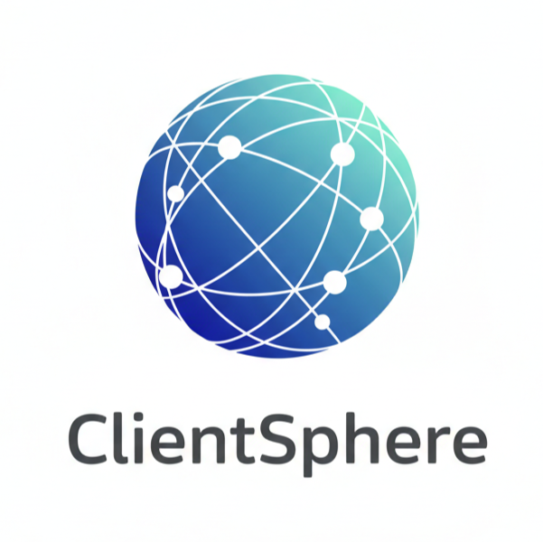

<<<<<<< HEAD
# ClientSphere



**AI-Powered Chatbot & CRM Platform** - Transform customer relationships with intelligent conversations.

## 🚀 Features

### Frontend (React + TypeScript)
- **Modern UI/UX**: Responsive design with mobile optimization
- **AI Chat**: Powered by Google Gemini for intelligent responses
- **Knowledge Base**: Upload PDFs and documents for AI context
- **CRM Dashboard**: Manage customer relationships
- **Multi-tenant**: Support multiple businesses/brands
- **Real-time Analytics**: Track conversations and insights
- **Widget System**: Embeddable chat widgets for websites

### Backend (Cloudflare Workers)
- **Serverless API**: Fast, globally distributed
- **Supabase Integration**: PostgreSQL database
- **Authentication**: JWT + Google OAuth
- **File Processing**: PDF text extraction
- **Knowledge Base API**: Document management

## 📁 Project Structure

```
clientsphere/
├── src/                    # React frontend
│   ├── components/         # Reusable UI components
│   ├── pages/             # Page components
│   │   ├── auth/          # Login, Signup
│   │   ├── admin/         # Admin dashboard
│   │   └── tenant/        # Tenant dashboard
│   ├── context/           # React contexts
│   ├── hooks/             # Custom React hooks
│   ├── lib/               # Utility functions
│   └── types/             # TypeScript definitions
├── mcp-backend/           # Cloudflare Worker backend
├── gemini-mcp-server/     # Python AI Server (Hugging Face)
├── public/                # Static assets
└── dist/                  # Built frontend
```

## 🛠️ Tech Stack

### Frontend
- **React 18** with TypeScript
- **Vite** for build tooling
- **Tailwind CSS** for styling
- **Framer Motion** for animations
- **React Router** for navigation
- **Radix UI** for components

### Backend
- **Cloudflare Workers** (Serverless)
- **Supabase** (PostgreSQL + Auth)
- **Google Gemini AI** for chat
- **JWT** for authentication

## 🚀 Quick Start

### Prerequisites
- Node.js 18+
- npm or yarn

### Installation

```bash
# Install dependencies
npm install

# Start development server
npm run dev

# Build for production
npm run build
```

### Environment Variables

Create a `.env.local` file:

```env
VITE_API_URL=https://your-backend.workers.dev
VITE_GEMINI_MCP_URL=https://your-ai-server.hf.space
VITE_GOOGLE_CLIENT_ID=your-google-client-id
VITE_APP_NAME=ClientSphere
VITE_APP_VERSION=1.0.0
```

## 🌐 Deployment

### Frontend (Cloudflare Pages)

```bash
npm run build
npx wrangler pages deploy dist --project-name=clientsphere
```

### Backend (Cloudflare Workers)

```bash
cd mcp-backend
npx wrangler deploy
```

## 📊 API Endpoints

| Endpoint | Method | Description |
|----------|--------|-------------|
| `/auth/signin` | POST | User login |
| `/auth/signup` | POST | User registration |
| `/api/knowledge-base` | GET/POST | Knowledge base CRUD |
| `/api/chat` | GET/POST | Chat messages |
| `/mcp/process` | POST | AI chat processing |
| `/health` | GET | Health check |

## 🎨 Screenshots

- **Landing Page**: Modern, animated hero section
- **Dashboard**: Analytics and quick actions
- **Knowledge Base**: Upload and manage documents
- **Live Chat**: Test AI responses in real-time

## 📄 License

MIT License - see [LICENSE](LICENSE) for details.

---

<<<<<<< HEAD
**ClientSphere** - Your customers, connected. 🌐
=======
Made with ❤️ by Chirag 
>>>>>>> 7c7c9ed51d81813405e7ded2f90e85d31ab34c6b
=======
---
title: RAG Backend
emoji: 🚀
colorFrom: pink
colorTo: indigo
sdk: docker
pinned: false
---

Check out the configuration reference at https://huggingface.co/docs/hub/spaces-config-reference
>>>>>>> c7164f2c30d7155283c30c509405593b5f517157
